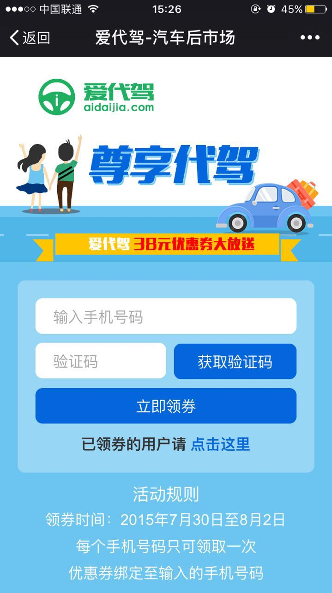
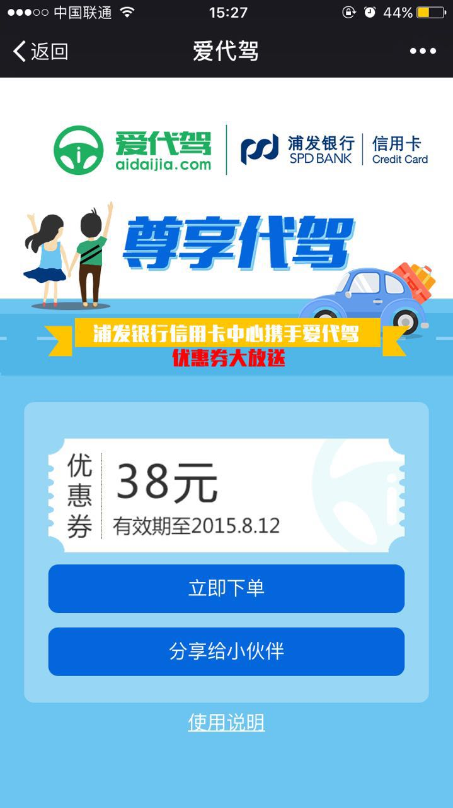
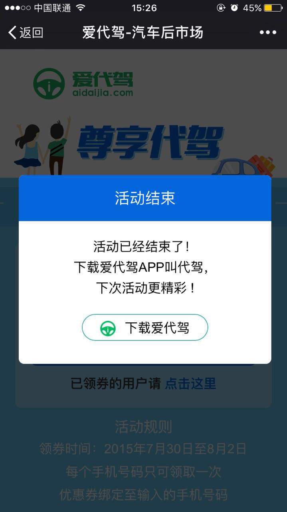
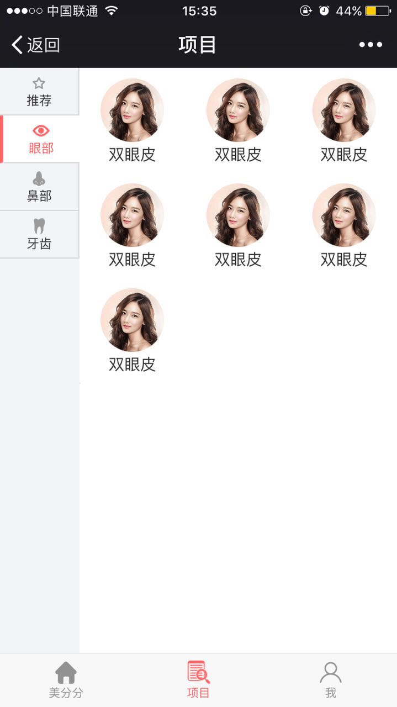
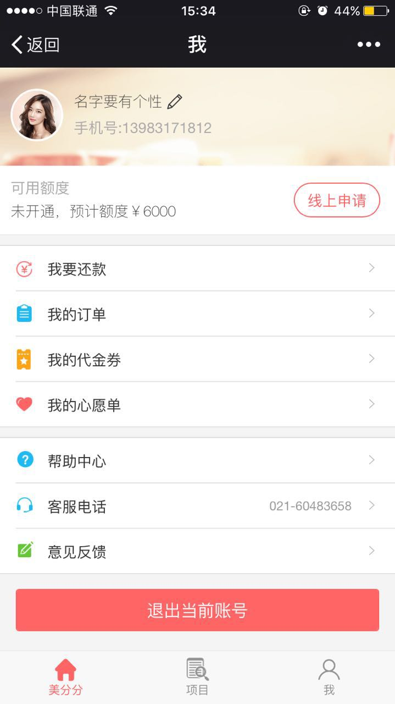
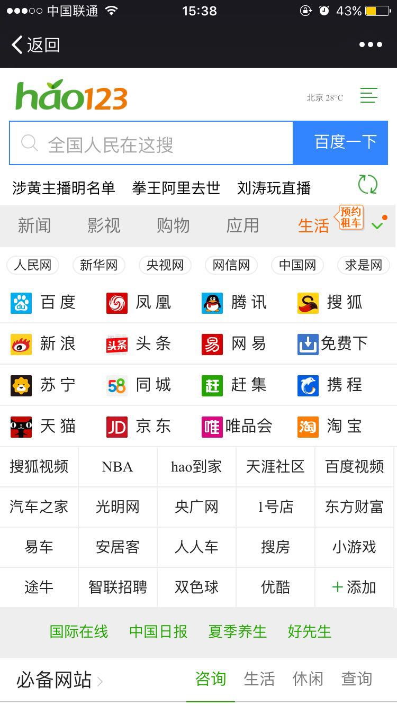

# 一些图片展示


### 爱代驾

<center>



</center>
 
 
### 美分分
 
<center>



</center>


###好123

<center>

</center>


####some code
```
$(function () {
            var sign;
            var nonce = generateMixed(15);
            var times = Date.parse(new Date());
            var url = location.href.split('#')[0];
            //判断系统中是否存在
            function getSign() {
                $.ajax({
                    async: false,
                    type: "GET",
                    url: "../../GetSignature.ashx?nonceStr=" + nonce + "&timestamp=" + times + "&url=" + encodeURIComponent(url),
                    dataType: "text",
                    success: function (data) {
                        sign = data;
                    },
                    error: function (XMLHttpRequest, textStatus, errorThrown) {
                        alert(textStatus);
                    },
                    complete: function (XMLHttpRequest, textStatus) {
                    }
                });
                return sign;
            }
            wx.config({
                debug: false, // 开启调试模式,调用的所有api的返回值会在客户端alert出来，若要查看传入的参数，可以在pc端打开，参数信息会通过log打出，仅在pc端时才会打印。
                appId: 'wx1fd2478602e6c8e4', // 必填，公众号的唯一标识
                timestamp: times, // 必填，生成签名的时间戳
                nonceStr: nonce, // 必填，生成签名的随机串
                signature: getSign(),// 必填，签名，见附录1
                jsApiList: ['onMenuShareTimeline', 'onMenuShareAppMessage'] // 必填，需要使用的JS接口列表，所有JS接口列表见附录2
            });

            wx.ready(function () {
                wx.onMenuShareTimeline({
                    title: '爱代驾38元大礼包，速速领取！', // 分享标题
                    link: 'http://wx.aidaijia.com/Activities/CarMarket/index.html', // 分享链接
                    imgUrl: 'http://wx.aidaijia.com/Activities/CarMarket/images/bg.jpg', // 分享图标
                    success: function () {
                    },
                    cancel: function () {
                    }
                });

                wx.onMenuShareAppMessage({
                    title: '爱代驾38元大礼包，速速领取！', // 分享标题
                    desc: '38元代驾券陪你拼！摆好姿势，速速领取！', // 分享描述
                    link: 'http://wx.aidaijia.com/Activities/CarMarket/index.html', // 分享链接
                    imgUrl: 'http://wx.aidaijia.com/Activities/CarMarket/images/bg.jpg', // 分享图标
                    type: 'link', // 分享类型,music、video或link，不填默认为link
                    dataUrl: '', // 如果type是music或video，则要提供数据链接，默认为空
                    success: function () {
                    },
                    cancel: function () {
                    }
                });
            });
        });
```
