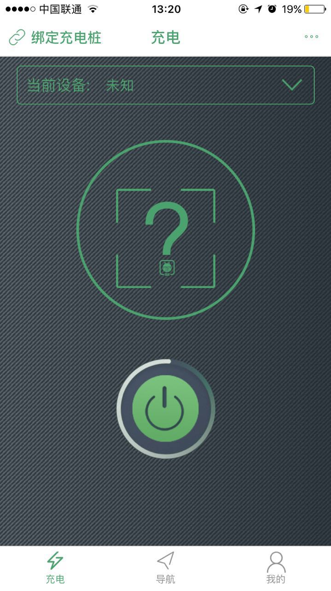
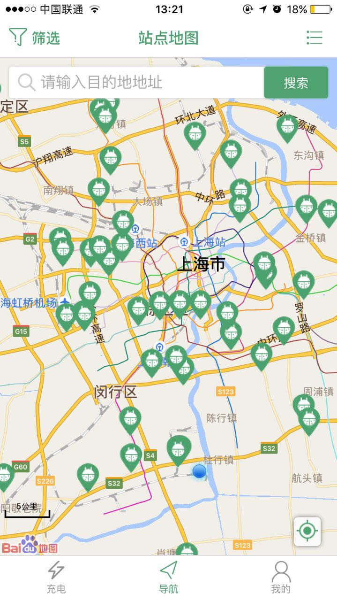
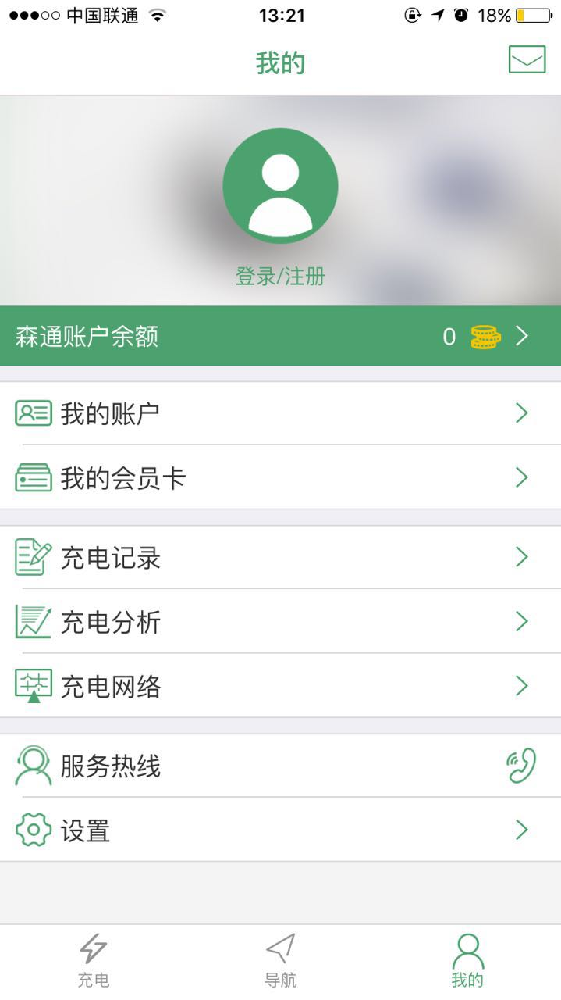
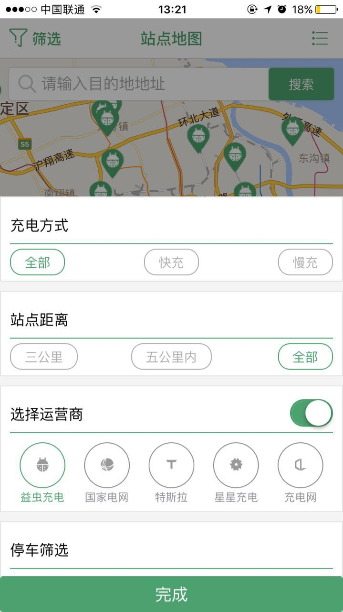
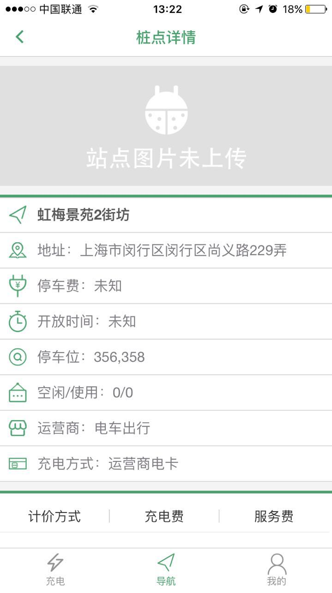
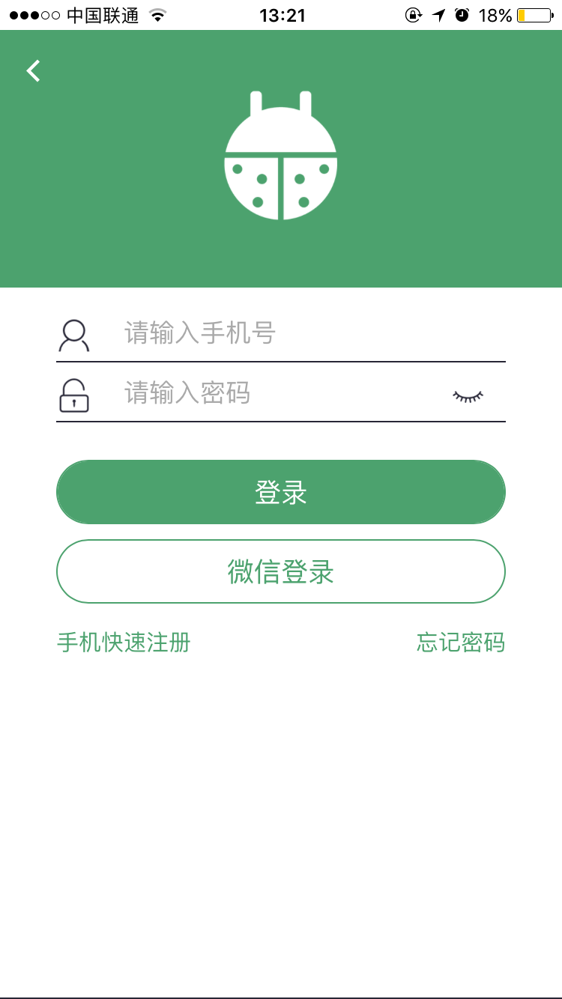
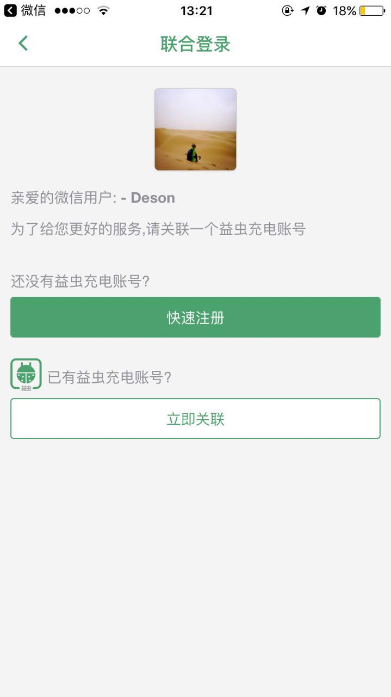
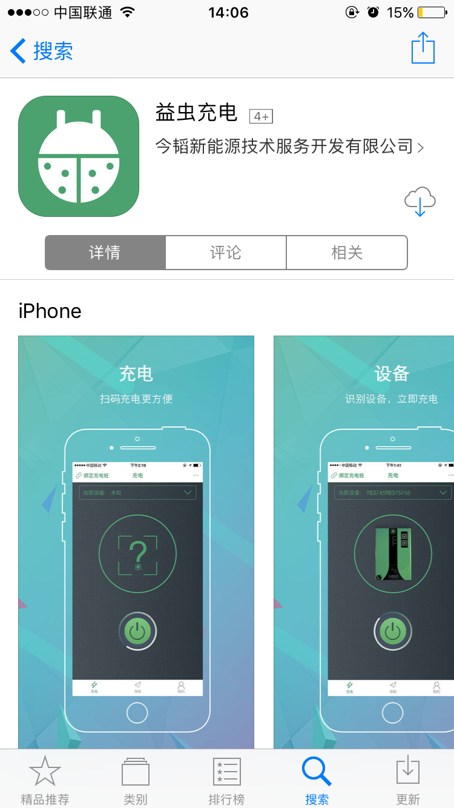

## MUI+H5Plus开发的跨平台WebApp

###效果图展示

###应用宝下载地址[http://sj.qq.com/myapp/detail.htm?apkName=com.evcorp.evchong](http://sj.qq.com/myapp/detail.htm?apkName=com.evcorp.evchong)	

    
 	
 	

-----------

    
 	
 	

-----------

 	
 	

-----------

	
	

 

